请帮我分析知识点之间的关联关系：

**目标主题**: $ARGUMENTS

## 执行步骤

### 1. 查找目标知识条目

#### 1.1 搜索知识库
搜索与指定主题相关的所有知识条目：
- 搜索标题包含主题的条目
- 搜索标签包含主题的条目
- 搜索内容中提及主题的条目

#### 1.2 显示搜索结果
```markdown
## 🔍 找到以下相关知识条目:

### 主要条目:
1. **[React Hooks](programming/react/react-hooks.md)** ⭐⭐⭐⭐
   - 文件大小: 15KB
   - 最后更新: 2025-12-10
   - 关联数: 8个

2. **[React Context](programming/react/react-context.md)** ⭐⭐⭐
   - 文件大小: 12KB
   - 最后更新: 2025-12-08
   - 关联数: 5个

### 分析:
- 主条目: React Hooks (最相关)
- 相关条目: 2个
- 总关联数: 13个

是否分析 "React Hooks" 的知识关联? (y/n)
# 或让用户选择特定条目
```

### 2. 分析目标条目的内容

#### 2.1 读取条目内容
读取选定的知识条目文件：
- 解析 YAML frontmatter 元数据
- 提取标题、章节、代码块
- 识别关键概念和技术术语

#### 2.2 提取关键信息
```markdown
## 📄 分析: React Hooks

### 🎯 基本信息
- **分类**: programming/react
- **标签**: #React #Hooks #JavaScript #WebDev
- **掌握度**: ⭐⭐⭐⭐
- **难度**: ⭐⭐⭐

### 📑 内容结构
- 核心概念: useState, useEffect, useContext
- 主要特点: 函数组件增强、状态管理
- 代码示例: 5个
- 章节数: 8个

### 🔑 关键术语
- Functional Component
- State Management
- Side Effects
- Custom Hooks
```

### 3. 建立知识关联

#### 3.1 关联类型定义
系统支持以下类型的知识关联：

**前置知识** (Prerequisites):
- 学习此主题前需要掌握的内容
- 权重: 5 (必须先学)

**直接依赖** (Direct Dependencies):
- 强相关的技术或概念
- 权重: 4 (强相关)

**相关概念** (Related Concepts):
- 相似或对比的概念
- 权重: 2 (弱相关)

**应用延伸** (Applications):
- 基于此主题的实际应用
- 权重: 3 (实践关联)

**工具资源** (Tools & Resources):
- 相关的工具、库、框架
- 权重: 2 (辅助)

#### 3.2 搜索关联条目
使用关键术语搜索知识库中的相关条目：
```python
# 伪代码
for term in key_terms:
    results = search_knowledge_base(term)
    for result in results:
        similarity = calculate_similarity(target, result)
        if similarity > threshold:
            relevance_type = determine_relevance_type(term, result)
            add_to_relations(result, relevance_type, similarity)
```

#### 3.3 显示关联分析结果
```markdown
## 🔗 知识关联分析: React Hooks

### 📊 关联统计
- **总关联数**: 15个
- **前置知识**: 2个
- **直接依赖**: 4个
- **相关概念**: 5个
- **应用延伸**: 3个
- **工具资源**: 1个

### 📈 关联图谱

```mermaid
graph TD
    A[React Hooks]

    %% 前置知识
    A -->|must| B1[JavaScript ES6]
    A -->|must| B2[React Components]

    %% 直接依赖
    A -->|strong| C1[Functional Programming]
    A -->|strong| C2[State Management]
    A -->|strong| C3[React Lifecycle]
    A -->|strong| C4[TypeScript]

    %% 相关概念
    A -.->|weak| D1[Vue Composition API]
    A -.->|weak| D2[Svelte Stores]
    A -.->|weak| D3[Redux]
    A -.->|weak| D4[Context API]
    A -.->|weak| D5[UseReducer Hook]

    %% 应用延伸
    A -->|apply| E1[Next.js]
    A -->|apply| E2[React Native]
    A -->|apply| E3[Custom Hooks]

    %% 工具资源
    A -.->|tool| F1[React DevTools]

    style A fill:#4CAF50
    style B1 fill:#FFC107
    style B2 fill:#FFC107
    style C1 fill:#2196F3
    style C2 fill:#2196F3
    style C3 fill:#2196F3
    style C4 fill:#2196F3
```



### 🔍 详细关联列表

#### 📚 前置知识 (2个) ⚠️ 必须先学

1. **[JavaScript ES6](programming/javascript/es6.md)** ⭐⭐⭐⭐⭐
   - **关联原因**: Hooks 依赖 ES6 的箭头函数、解构、模板字符串
   - **重要性**: ⭐⭐⭐⭐⭐ (无法绕过)
   - **建议掌握度**: ⭐⭐⭐⭐⭐
   - **学习优先级**: 🔥 最高

2. **[React Components](programming/react/components.md)** ⭐⭐⭐⭐
   - **关联原因**: Hooks 只能在函数组件中使用
   - **重要性**: ⭐⭐⭐⭐⭐ (核心概念)
   - **建议掌握度**: ⭐⭐⭐⭐
   - **学习优先级**: 🔥 最高

#### 🔗 直接依赖 (4个) 💪 强相关

1. **[Functional Programming](programming/fp/basics.md)** ⭐⭐⭐
   - **关联原因**: Hooks 基于函数式编程范式
   - **重要性**: ⭐⭐⭐⭐
   - **建议掌握度**: ⭐⭐⭐
   - **学习优先级**: ⚡ 高

2. **[State Management](programming/react/state-mgmt.md)** ⭐⭐⭐⭐
   - **关联原因**: Hooks 用于组件状态管理
   - **重要性**: ⭐⭐⭐⭐⭐
   - **建议掌握度**: ⭐⭐⭐⭐
   - **学习优先级**: ⚡ 高

3. **[React Lifecycle](programming/react/lifecycle.md)** ⭐⭐⭐
   - **关联原因**: Hooks 替代了生命周期方法
   - **重要性**: ⭐⭐⭐⭐
   - **建议掌握度**: ⭐⭐⭐
   - **学习优先级**: ⚡ 高

4. **[TypeScript](programming/typescript/basics.md)** ⭐⭐⭐
   - **关联原因**: TypeScript + Hooks 是最佳实践
   - **重要性**: ⭐⭐⭐
   - **建议掌握度**: ⭐⭐⭐
   - **学习优先级**: 📊 中

#### 💡 相关概念 (5个) 🔄 弱相关

1. **[Vue Composition API](programming/vue/composition-api.md)** ⭐⭐⭐
   - **关联原因**: Vue 的类似方案
   - **对比价值**: ⭐⭐⭐⭐
   - **学习用途**: 对比学习，理解不同框架

2. **[Svelte Stores](programming/svelte/stores.md)** ⭐⭐
   - **关联原因**: Svelte 的状态管理方案
   - **对比价值**: ⭐⭐⭐
   - **学习用途**: 拓展视野

3. **[Redux](programming/react/redux.md)** ⭐⭐⭐⭐
   - **关联原因**: Hooks 可以简化 Redux 使用
   - **对比价值**: ⭐⭐⭐⭐⭐
   - **学习用途**: 了解状态管理演进

4. **[Context API](programming/react/context.md)** ⭐⭐⭐
   - **关联原因**: useContext Hook 基于 Context API
   - **集成价值**: ⭐⭐⭐⭐⭐
   - **学习用途**: 配合使用

5. **[UseReducer Hook](programming/react/hooks/use-reducer.md)** ⭐⭐⭐⭐
   - **关联原因**: useState 的替代方案
   - **集成价值**: ⭐⭐⭐⭐⭐
   - **学习用途**: 高级状态管理

#### 🚀 应用延伸 (3个) 💼 实践

1. **[Next.js](programming/nextjs/basics.md)** ⭐⭐⭐⭐⭐
   - **关联原因**: Next.js 深度集成 Hooks
   - **应用场景**: SSR、SSR、静态生成
   - **学习优先级**: ⚡ 高

2. **[React Native](programming/react-native/basics.md)** ⭐⭐⭐⭐
   - **关联原因**: RN 使用相同的 Hooks
   - **应用场景**: 移动应用开发
   - **学习优先级**: 📊 中

3. **[Custom Hooks](programming/react/hooks/custom.md)** ⭐⭐⭐⭐
   - **关联原因**: 创建可复用的 Hooks
   - **应用场景**: 逻辑抽象和复用
   - **学习优先级**: ⚡ 高

#### 🛠️ 工具资源 (1个)

1. **[React DevTools](tools/react-devtools.md)** ⭐⭐⭐⭐
   - **用途**: 调试和性能分析
   - **重要性**: ⭐⭐⭐⭐
   - **学习优先级**: 📊 中
```

### 4. 推荐学习路径

#### 4.1 从零开始路径
```markdown
## 🛤️ 完整学习路径: React Hooks

### 第0步: 前置知识 (必须先学)
**预计时间**: 2-3天
1. **JavaScript ES6** (1天)
   - 箭头函数
   - 解构赋值
   - 模板字符串
   - Promise/async-await

2. **React Components** (1-2天)
   - 函数组件基础
   - Props 和 State
   - 组件渲染

### 第1步: React Hooks 核心概念
**预计时间**: 3-5天
1. **useState** (1天)
   - 基础用法
   - 对象和数组
   - 惰性初始化

2. **useEffect** (2天)
   - 副作用处理
   - 依赖数组
   - 清理函数

3. **useContext** (1天)
   - Context API
   - 跨组件通信
   - 性能优化

4. **useReducer** (1天)
   - 复杂状态管理
   - Reducer 模式
   - 对比 Redux

### 第2步: 高级 Hooks
**预计时间**: 2-3天
1. **useMemo & useCallback**
2. **useRef & useImperativeHandle**
3. **useLayoutEffect & useDebugValue**

### 第3步: 自定义 Hooks
**预计时间**: 2-3天
1. **设计模式**
2. **常见场景**
3. **最佳实践**

### 第4步: 实战项目
**预计时间**: 5-7天
1. **项目1**: Todo List (基础 Hooks)
2. **项目2**: 数据获取 (useEffect + useState)
3. **项目3**: 自定义 Hooks (复用逻辑)

### 第5步: 深入应用
**预计时间**: 持续
1. **Next.js 集成**
2. **性能优化**
3. **测试策略**

**总时长**: 约15-20天 (每天2-3小时)
```

#### 4.2 快速提升路径
```markdown
## ⚡ 快速提升路径 (有基础)

### 前置条件
- ✅ 已掌握 JavaScript ES6
- ✅ 已了解 React Components

### 学习路径 (5天)
**Day 1**: useState + useEffect (核心)
**Day 2**: useContext + useReducer (状态管理)
**Day 3**: useMemo + useCallback (性能优化)
**Day 4**: 自定义 Hooks (实践)
**Day 5**: 实战项目 (整合应用)
```

### 5. 发现知识盲区

#### 5.1 识别缺失的关联
```markdown
## 🔍 知识盲区分析

### ⚠️ 发现的盲区 (4个)

#### 1. **React 性能优化** (高优先级)
- **缺失度**: 80%
- **原因**: Hooks 学习中涉及性能，但没有系统学习
- **影响**: 无法写出高性能的 React 应用
- **建议**:
  1. 学习 React.memo
  2. 理解重渲染机制
  3. 掌握 useMemo/useCallback 最佳实践
- **学习时间**: 1天
- **资源**: [React 性能优化指南](链接)

#### 2. **Hooks 测试** (中优先级)
- **缺失度**: 70%
- **原因**: 没有学习如何测试使用 Hooks 的组件
- **影响**: 代码质量无法保证
- **建议**:
  1. 学习 @testing-library/react
  2. 编写 Hook 测试
  3. Mock 技巧
- **学习时间**: 2天
- **资源**: [React Testing Library](链接)

#### 3. **React 并发模式** (中优先级)
- **缺失度**: 60%
- **原因**: Hooks 与并发特性的结合
- **影响**: 无法利用 React 18+ 新特性
- **建议**:
  1. 理解并发渲染
  2. 学习 useTransition
  3. 学习 useDeferredValue
- **学习时间**: 1天
- **资源**: [React 并发文档](链接)

#### 4. **Server Components** (低优先级)
- **缺失度**: 50%
- **原因**: 前沿技术，还在发展中
- **影响**: 无法使用最新 React 特性
- **建议**:
  1. 理解 RSC 原理
  2. 学习 Next.js 13+ 集成
  3. 实践项目
- **学习时间**: 2天
- **资源**: [React Server Components](链接)

### 📊 知识覆盖度
```
React 生态系统知识覆盖
├── 基础: ██████████ 100%
├── Hooks: ██████████ 90%
├── 状态管理: ████████ 80%
├── 性能优化: ████ 40% ⚠️
├── 测试: █████ 50% ⚠️
├── 并发模式: █████ 50% ⚠️
└── Server Components: ████ 40% ⚠️

整体覆盖度: 65%
```

### 💡 补充学习建议

#### 短期 (1周内)
1. **React 性能优化** (Day 1-2)
2. **Hooks 测试** (Day 3-5)

#### 中期 (1月内)
3. **React 并发模式** (Week 2)
4. **Server Components** (Week 3-4)

#### 长期 (持续)
5. 关注 React 19+ 新特性
6. 学习社区最佳实践
```

### 6. 建立知识关联

#### 6.1 询问用户是否自动建立关联
```markdown
## 🔗 自动建立知识关联

发现以下可以建立的关联：

### 需要添加反向链接的条目 (5个):
1. [JavaScript ES6](programming/javascript/es6.md)
   - 添加: React Hooks 作为应用示例
2. [React Components](programming/react/components.md)
   - 添加: Hooks 作为函数组件增强
3. [State Management](programming/react/state-mgmt.md)
   - 添加: Hooks 作为状态管理方案
4. [Context API](programming/react/context.md)
   - 添加: useContext Hook 作为使用方式
5. [Redux](programming/react/redux.md)
   - 添加: Hooks 与 Redux 的配合

### 需要更新元数据的条目 (3个):
1. [React Hooks](programming/react/hooks.md)
   - 更新 related 字段
2. [React Components](programming/react/components.md)
   - 添加关联到 Hooks
3. [State Management](programming/react/state-mgmt.md)
   - 添加关联到 Hooks

### 操作选项:
1. ✅ 全部自动建立 (推荐)
2. 📋 显示详细变更预览
3. ✏️ 交互式确认每个关联
4. ❌ 取消，手动处理

选择 (1/2/3/4):
```

#### 6.2 执行关联建立
```markdown
## ✅ 正在建立知识关联...

### 更新反向链接 (5/5)
✅ [JavaScript ES6] - 添加 React Hooks 应用
✅ [React Components] - 添加 Hooks 关联
✅ [State Management] - 添加 Hooks 方案
✅ [Context API] - 添加 useContext 关联
✅ [Redux] - 添加 Hooks 集成

### 更新元数据 (3/3)
✅ [React Hooks] - 更新 related 字段
✅ [React Components] - 添加关联
✅ [State Management] - 添加关联

### 统计
- 更新文件: 8个
- 新增链接: 13个
- 新增关联: 8个
```

### 7. 生成关联报告

```markdown
## 📊 知识关联分析报告

### 🎯 分析主题: React Hooks

### ✅ 完成情况
- ✅ 搜索相关条目
- ✅ 分析内容结构
- ✅ 识别关键术语
- ✅ 建立知识关联
- ✅ 生成知识图谱
- ✅ 推荐学习路径
- ✅ 发现知识盲区
- ✅ 建立关联链接

### 📈 关联统计
- **总关联数**: 15个
- **前置知识**: 2个
- **直接依赖**: 4个
- **相关概念**: 5个
- **应用延伸**: 3个
- **工具资源**: 1个
- **已建立链接**: 8个

### 🗺️ 知识图谱
- ✅ Mermaid 格式图谱已生成
- 📁 文件: graphs/react-hooks-connections.md
- 🖼️ 可视化: graphs/react-hooks-connections.png

### 🛤️ 学习路径
- ✅ 完整学习路径 (15-20天)
- ✅ 快速提升路径 (5天)
- 📁 文件: learning-paths/react-hooks.md

### 🔍 知识盲区
- ⚠️ 发现盲区: 4个
- 📁 文件: knowledge-gaps/react-gaps.md
- 💡 补充建议已生成

### 🔗 建立的关联
- 更新文件: 8个
- 新增链接: 13个
- 元数据更新: 3个

### 📁 生成的文件
1. **graphs/react-hooks-connections.md** - Mermaid 图谱
2. **graphs/react-hooks-connections.png** - 渲染图像
3. **learning-paths/react-hooks.md** - 学习路径
4. **knowledge-gaps/react-gaps.md** - 盲区分析

### 🎯 下一步建议

1. **补充学习**:
   - React 性能优化 (2天)
   - Hooks 测试 (2天)
   - React 并发模式 (1天)

2. **实践项目**:
   - Todo List (基础 Hooks)
   - 数据获取 App (useEffect + useState)
   - 自定义 Hooks 库

3. **知识复习**:
   - /review react-hooks (巩固记忆)
   - /review javascript-es6 (前置知识)

### 🚀 后续操作
选择:
1. 查看知识图谱
2. 查看学习路径
3. 查看知识盲区
4. 开始补充学习
5. 完成分析

选择 (1/2/3/4/5):
```

## 高级功能

### 全局知识图谱
生成整个知识库的关联图谱：
```bash
/connect --graph=all
```

### 领域知识图谱
生成特定领域的知识图谱：
```bash
/connect --graph=ai-ml
/connect --graph=programming/react
```

### 学习路径推荐
基于当前知识推荐学习路径：
```bash
/connect --recommend
```

### 关联强度分析
分析关联的强度和质量：
```bash
/connect --analyze="react-hooks" --detail
```

## 输出格式

### Mermaid 图谱
```markdown
\`\`\`mermaid
graph TD
    A[主题]
    B[前置知识]
    C[相关概念]
    D[应用延伸]

    A -->|must| B
    A -->|strong| C
    A -->|apply| D
\`\`\`
```

### JSON 格式
```json
{
  "topic": "React Hooks",
  "relations": {
    "prerequisites": [
      {"topic": "JavaScript ES6", "strength": 5, "file": "..."}
    ],
    "related": [
      {"topic": "Vue Composition API", "strength": 2, "file": "..."}
    ]
  }
}
```

## 注意事项

1. **关联准确性**:
   - 确保关联是有意义的
   - 避免过度关联
   - 验证关联的正确性

2. **图谱可视化**:
   - 大型图谱可能难以阅读
   - 使用分层或聚类
   - 提供过滤选项

3. **学习路径**:
   - 考虑用户的现有水平
   - 提供多种路径选择
   - 标注时间估算

4. **知识盲区**:
   - 基于实际需求分析
   - 提供优先级排序
   - 给出具体学习建议

## 相关命令

- `/learn [主题]` - 学习新知识
- `/review [主题]` - 复习知识
- `/find-gaps` - 发现知识盲区
- `/organize` - 整理知识库
